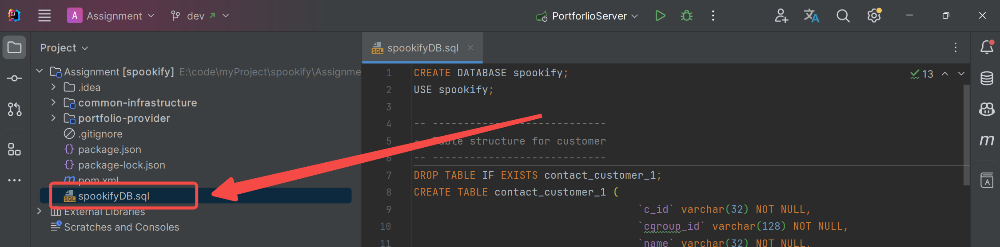

# Spookify

**Program Elective Assignment**

1. **Basic Introduction**

   Conventional JavaWeb project

   Technologies used: SpringBoot + Vue + Docker (to be confirmed) + MyBatis(Plus) + SpringCloud (to be confirmed)

2. **How to run**

   1. Open the `spookifyDB.sql`, copy all the code.

      

   2. Execute sql

      * if you have DBMS like `DataGrip`, paste the sql code to it and execute the code.

        

      * if you want to execute the sql code in  `Command Prompt`, follow this steps:

        1. open task manager, make sure mysql service has started.

           

        2. open command prompt, type `mysql -uroot -p`, and then enter the password to log in mysql.

           after logging in, paste sql code and press `enter`.

           

   3. Open our project, click `PortforlioServer`, and **right click** the run button.

      

      select `Modify Run Configuration`:

      

      In the popping window, click `Modify options`, select `Working directory`, and the rest of the configuration is shown below:

      

   4. Go to `application-dev.yml`, change the `username` and `password` to those in **your MySQL**

      

   5. Run `PortforlioServer`, wait until it fully starts

      

      

3. **Important Notes**

   - **All submissions should be made to the dev branch**; remote merging into master is the responsibility of the team leader.
   - For large files, create a local folder, write your own `.gitignore`, and do not upload it to the repository!
   - Provide detailed commit messages with each submission, for traceability.
   - It is recommended to create multiple development branches locally.

4. **Relevant Resources**

   [SpringBoot Learning Resources](https://www.yuque.com/leifengyang/springboot3/vznmdeb4kgn90vrx): In-depth content on SpringBoot, a crucial component in the Spring ecosystem, known for its rapid integration of various common technologies.

   [JavaScript Learning Resources](https://www.runoob.com/jsref/dom-obj-attributes.html): Commonly used resources, effective for learning.

   [JavaScript Documentation](https://developer.mozilla.org/zh-CN/): Reference material for JavaScript queries.

   [Git Documentation](https://git-scm.com/book/zh/v2): Reference for Git commands and principles.

   [MyBatis](https://www.cnblogs.com/diffx/p/10611082.html): A commonly used persistence framework for data access, used in conjunction with the MySQL database.

   [SpringCloud](https://chat.openai.com/c/dcb26dce-4948-4847-b2f8-80c7a09ddd2f): Another essential component in the Spring ecosystem, used for the rapid construction of microservices architecture.

   [Docker](https://learn.lianglianglee.com/专栏/由浅入深吃透 Docker-完): Recommend downloading [Docker Desktop for Windows](https://www.docker.com/products/docker-desktop/) for continuous integration and deployment. In the future, databases and message queues can be downloaded into Docker. Docker is extremely lightweight and efficient (see image below of 4 Nacos and 2 MySQL databases on my local Docker).

   

5. **Others**

   After downloading and configuring Docker, you can install MySQL, various message queues, and registry centers, and **then you can delete large local programs like MySQL**. By connecting to Docker through IDEA, you can quickly start any container.

   I have personally tested all the steps mentioned above, and everything runs smoothly. If you have any questions, feel free to consult QJY.

   Best of luck to everyone!!!

   